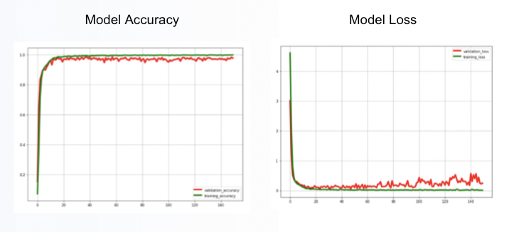
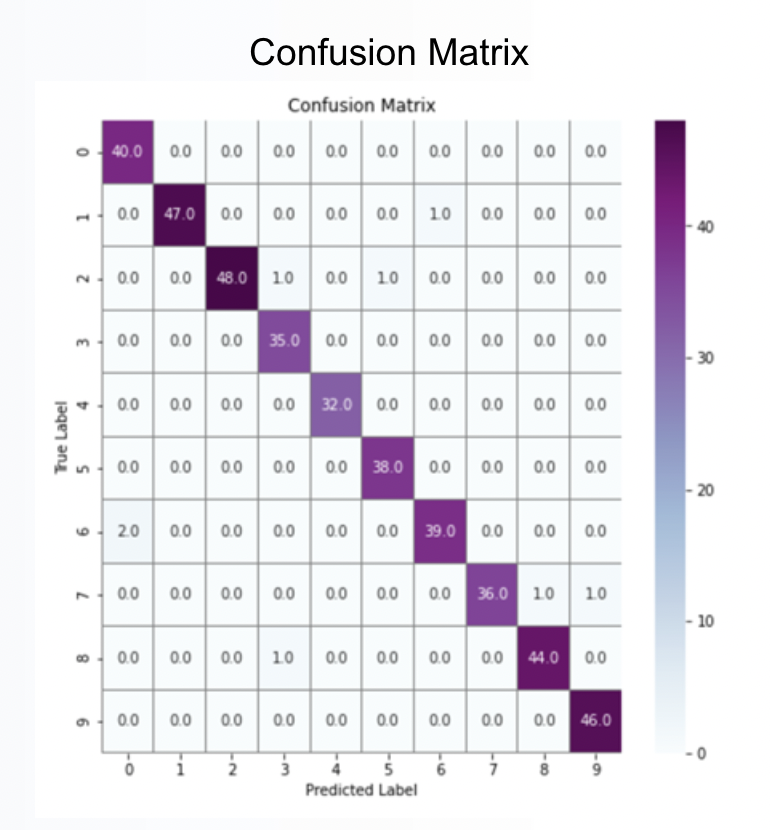
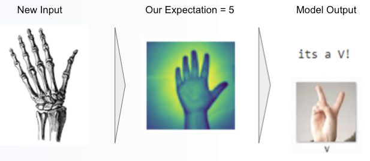

# Project 2 - AI Machine Learning Fintech

Data Sources:
* ASL Digit pictures dataset source: https://www.kaggle.com/orhansertkaya/convolutional-neural-network-sign-language-digits.  However these are 64x64 pixel pictures in numpy array.
* ASL Alphabet pictures dataset source: https://www.kaggle.com/datamunge/sign-language-mnist?select=sign_mnist_test. However these are 28x28 pixel pictures in csv format.

---
## Project Goal:

Train a machine learning model to successfully recognise American Sign Language alphabet and digit hand signals.

## Methodology:

- Build initial Machine Learning model to successfully recognise ASL digit hand signals. (10 symbols).

- Determine if the model can be re-fit for both ASL alphabet & digit hand signals. 
(34 symbols.  The symbols for J and Z are excluded as they are movement based.)

- Test additional hand pictures to see how model responds to other hand shapes.

## Digits Model:

In this section, we have used a dataset of 2062 images of ASL digit hand symbols, 4 x 64 pixel black and white images and 80/20 train vs test split.

### Structure Digits Model:

### New Model Used - CNN: 
A convolutional layer contains a set of parameters that need to be learned. Each filter is convolved with the input volume to compute an activation map. The activation map is slid across the width and height of the input in a "pool size" set in the model architecture with the weights computed at every spatial position.

### Digits Model Validation:
After 100 epochs, validation accuracy at 98.5%+ and validation loss at 0.06%.

### Digits Model Consion Matrix:

## Alphabet Dataset:

In this section, we have first used a dataset of 34,627 images of ASL alphabet hand symbols, 28 x 28 pixel black and white images, in csv format, and the train vs test split were 80/20.

Then, we had to transform the dataset as required with Pixel values adjusted from 0-255 to between 0-1, One hot encoding of y class, mage augmentation (rotate, flip, shift, apply whitening, divide by std) and Resized images to 64 x 64.

  

## Combined Alphabet & Digits Model:

In this section, we have combined the two dataset ASL digit and alphabet hand symbols with 36,684 images in total. The data was amended to numpy array using block_diag to join the 2 datasets. The train vs test split were 80/20.

Finally, we used the same structure and compile as Digits model.

### Model Validation:
After 150 epochs, validation accuracy at 97.6%+ and validation loss at 24.6%.

### Model Consion Matrix:

## Model Testing with Additional Images:

### Image # 1

We have run our model giving it a new input/image to expect the selected image an output, the our model provided...

### Image # 2

We have run our model giving it a new input to expect the selected image as output, the our model provided...

### Image # 3

We have run our model giving it a new input to expect the selected image as output, the our model provided...

### Image # 4

We have run our model giving it a new input to expect the selected image as output, the our model provided...

## Learnings:

- Accuracy of data - labelling / resolution of data - integrity of data
- Significant difference in model accuracy output between running on own computer vs running on Google Colab.
- Colab run models may not be compatible to your computer (not backward version compatible).
- Adjusting of final layer output classes.
- Diagonally stack two data frames to create one data frame without losing any data.
- Early stopping of epochs
